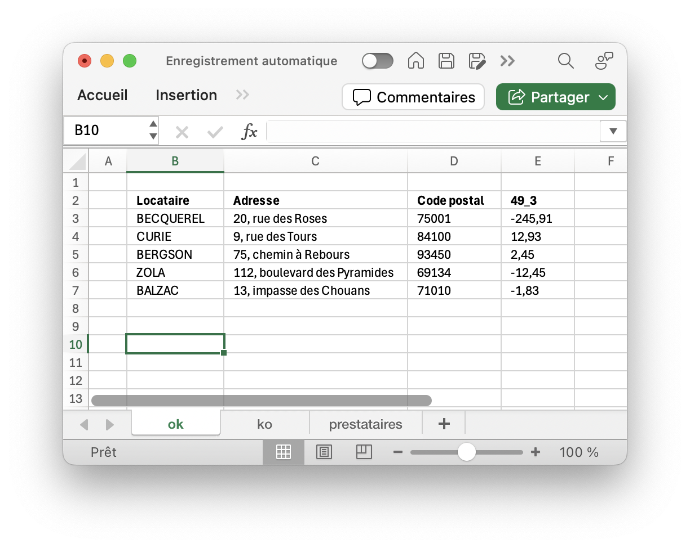
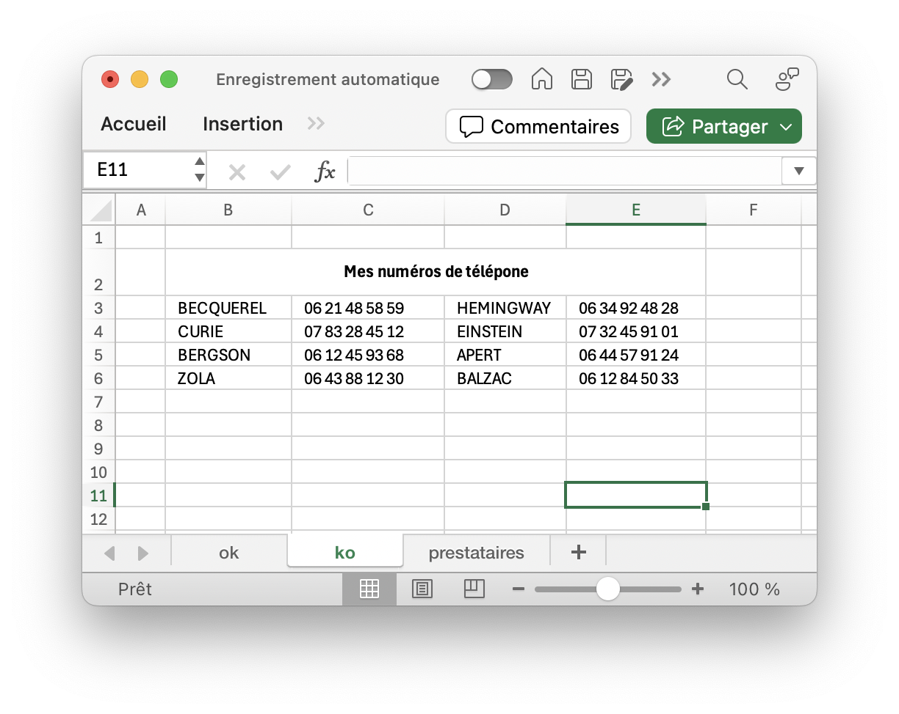
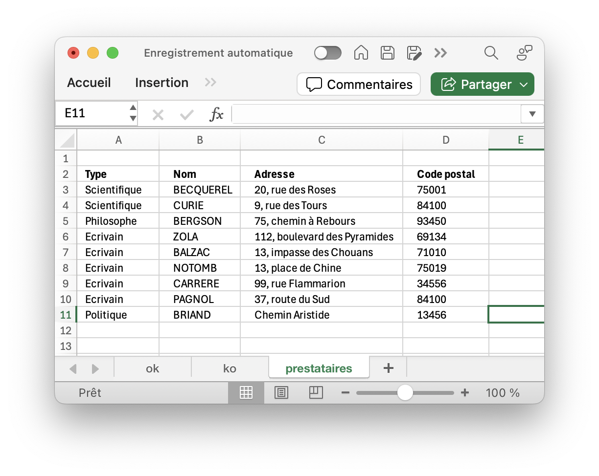
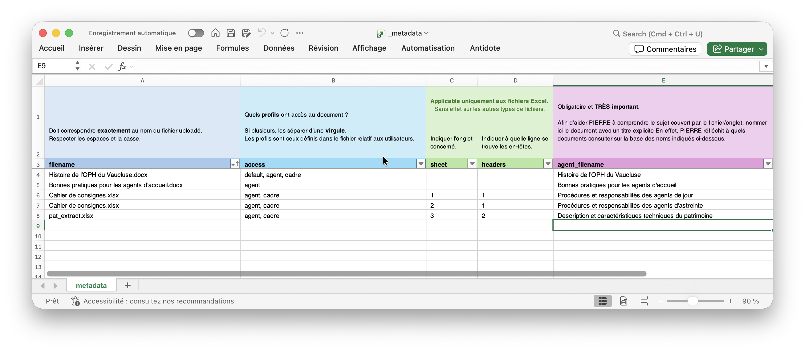

# Guide : préparer vos documents pour `PIERRE`

Ce guide présente quels types de fichiers peuvent être transmis à `PIERRE` et comment les préparer pour qu’il les comprenne le mieux possible. Il décrit également le fichier spécial `_metadata.xlsx`, indispensable pour que `PIERRE` sache comment utiliser vos documents et avec qui les partager.

## Sommaire

<!-- toc -->

- [Quels fichiers sont acceptés par `PIERRE` pour enrichir sa base de connaissances](#quels-fichiers-sont-accept%C3%A9s-par-pierre-pour-enrichir-sa-base-de-connaissances)
  - [Comment bien préparer vos documents ?](#comment-bien-pr%C3%A9parer-vos-documents)
- [`_metadata.xlsx` : un fichier pour les gouverner tous (obligatoire)](#_metadataxlsx--un-fichier-pour-les-gouverner-tous-obligatoire)

<!-- tocstop -->

## Quels fichiers sont acceptés par `PIERRE` pour enrichir sa base de connaissances

Les organismes de logement social (OLS ci-après) peuvent enrichir `PIERRE` de leurs propres données afin d'obtenir des réponses parfaitement adaptées à leur contexte. A titre d'exemple, il convient de founir à `PIERRE` les coordonnées du service-client afin qu'il puisse répondre aux demandes correspondantes.

À ce jour, `PIERRE` reconnaît uniquement les fichiers aux formats suivants :

- `.xlsx` (Microsoft Excel)
- `.docx` (Microsoft Word)
- `.md` (Markdown)

> [!CAUTION]
> Les fichiers d’autres formats (`.pdf`, `.jpeg`, `.png`, etc.) ne sont pas compris par `PIERRE`. Par exemple : un fichier Excel enregistré en `.xls` ou `.xlsb` ne fonctionnera pas ; il faut absolument l’enregistrer en `.xlsx`.

**Qu'est-ce que le Markdown ?**

Le Markdown est un langage de balisage léger qui permet de formater du texte de manière simple et lisible ; il est principalement utilisé pour la rédaction de documents, de contenus web ou encore de notes. Il a été conçu pour être facile à lire dans sa forme brute. Grâce à sa syntaxe intuitive, Markdown permet de structurer un texte rapidement sans avoir à utiliser de balises complexes.

Voici quelques exemples courants :

- Pour un titre de niveau 1, on utilise : # Titre 1
- Pour un titre de niveau 2 : ## Titre 2
- Pour du texte en gras : \*\*texte en gras\*\*
- Pour du texte en italique : \_italique\_

### Comment bien préparer vos documents ?

#### Préparer vos documents `.docx` et `.md`

Les fichiers `.docx` ou `.md` sont – _in fine_ et peu importe les modalités de traitement des données par `PIERRE` – des « fichiers-textes », qu’il s’agisse d’un modèle de courrier pour déposer son congé, d’une note de service sur le déroulé d’une CALEOL ou encore de la description du processus d’attribution au sein d'un OLS, etc.

Pour que `PIERRE` les comprenne le mieux possible, pensez à les écrire/formater comme si vous vouliez en expliquer clairement le contenu à un nouveau collègue :

- Utilisez des titres et sous-titres clairs
- Évitez de mélanger plusieurs sujets dans une même section
- Regroupez les informations similaires au même endroit
- Définissez les acronymes (ou mieux, évitez les)
- Évitez les fautes de grammaire ou d’orthographe
- Si vous écrivez en Markdown, respectez le balisage (titres, listes, gras, italique, etc.)

> [!CAUTION]
> Les images contenues dans vos fichiers `.docx` et `.md` **NE SONT PAS interprétées**.

#### Préparer vos fichiers `.xlsx`

Pour que `PIERRE` comprenne vos fichiers Excel :

1. Utiliser Excel comme un tableur (= lignes x colonnes) et non comme un fichier Word.

- A gauche, un véritable tableau : chaque ligne correspond à une donnée et facile à lire ligne par ligne
- A droite, un « faux » tableau : texte organisé visuellement mais impossible à lire automatiquement.

  
  

2. Donnez des noms de colonnes explicites et claires, y compris pour un non connaisseur : `49_3` (exemple de gauche) est une référence cryptique à une donnée, il faudrait – par exemple – indiquer “Solde locataire”.

3. Soyez cohérent dans l'usage des majuscules/minuscule et évitez les acronymes qui peuvent être ambigus.

4. Évitez a maxima de fusionner des cellules.

5. Ajoutez une colonne permettant à `PIERRE` de regrouper les données ci-besoin. À titre d'exemple ci-dessous, une colonne `type` a été ajoutée pour permettre à `PIERRE` de regrouper ensemble les scientifiques, écrivains, philosophes et politiques. En permettant à `PIERRE` de regrouper des lignes du fichier Excel, cela lui permet d'avoir à l'esprit – par exemple – tous les écrivains contenus dans le ficher Excel lorsque vous l'interrogez sur les écrivains.

  

## `_metadata.xlsx` : un fichier pour les gouverner tous (obligatoire)

Le fichier `_metadata.xlsx` est un fichier obligatoire sans lequel `PIERRE` n'est PAS CAPABLE d'apprendre vos données ni de les utiliser à bon escient. Ce fichier indique à `PIERRE` :

- Quelle stratégie d’importation il lui faut appliquer à chaque fichier que vous allez lui fournir,
- Qui a accès à la donnée contenue dans le fichier.

Il se présente comme ci-dessous et est téléchargeable depuis la page `Encyclopédie` de l'interface d'administration :

- Pour les fichiers `.docx` et `.md`, seules les colonnes `A` et `B` sont à compléter.  
  Pour les fichiers `.xlsx`, les colonnes `A`, `B` , `C`, `D`, `F` sont obligatoires, `E` et `G` sont optionnelles mais recommandées.

- **Colonne A** : nom exact du fichier (la correspondance doit être parfait avec le nom réel du fichier)  
  👉 Si le nom ne correspond pas, `PIERRE` ignorera le fichier.

- **Colonne B**: profils-utilisateurs autorisés à accéder à cette donnée  
  En ligne 5, `PIERRE` sait qu'il ne peut communiquer le contenu de `Cahier de consignes (jour).xlsx` qu'aux collaborateurs ayant le profil `agent_jour`.

**Les colonnes ci-dessous ne sont à compléter et applicables qu'aux fichiers `.xslx`**

- **Colonne C** : numéro de l’onglet concerné (1 = premier onglet, 2 = deuxième, 3 = troisième, etc.).  
  👉 Si vous voulez faire apprendre à `PIERRE` 3 onglets, vous devez donc avoir 3 lignes dans `_metadata.xlsx`.

- **Colonne D** : numéro de la ligne qui contient les entêtes  
  En guise d’exemple, dans la capture ci-dessous, la ligne d’entête est en ligne 2 (elle pourrait dans un autre onglet être en ligne 1 ou 25).

  

- **Colonne E** (optionnelle, mais recommandée) : indique à `PIERRE` comment regrouper les données (_cf._ supra). Dans l'exemple ci-dessus, il serait pertinent de regrouper les données par `type` (colonne A soit la colonne 1) afin que les écrivains restent grouper.

- **Colonne F** : indique à `PIERRE` s’il doit interpréter le tableau ligne à ligne (`true`) ou d’un seul bloc (`false`). Prenons quelques exemples pour comprendre la logique sur la base de l'exemple ci-dessus et imaginons qu'il s'agisse de la liste des personnages dont nous devons apprendre la biographie d'ici la fin de l'année.
  - Si le fichier contient une dizaine de lignes (comme ici), on comprend qu'il est plus logique que `PIERRE` considère ce tableau comme un tout cohérent (la liste des biographies à connaitre) plutôt que comme 10 éléments indépendants. De fait on indiquera `false` (= NE PAS lire ce tableau ligne-à-ligne). Généralement, on peut appliquer ce paramètre (`false`) pour des tableux contenant a maxima 500 cellules (ex : 50 lignes x 10 colonnes)
  - Si le fichier contient 1 000 lignes (par exemple, les 1 000 résidences d'un bailleur social) et que les colonnes présentent leurs caractéristiques techniques, alors on comprend que la résidence A est distincte de la résidence B. De fait on indiquera `true` (= lire ce tableau ligne-à-ligne).

- **Colonne G** : description de l’onglet  
  Il est recommandé de la compléter afin de donner des éléments de contexte à `PIERRE` sur ce que représente soit le fichier `xlsx` dans son intégralité, soit une unique ligne (selon ce qui a été indiqué en colonne `F`). En guise d'exemple, une description du fichier ci-dessous aurait pu être : _"Ci-après la liste des personnages célébres dont les éléves de Terminal Littéraire doit apprendre et connaitre parfaitement la biographie complète durant leur année scolaire"_.

  

