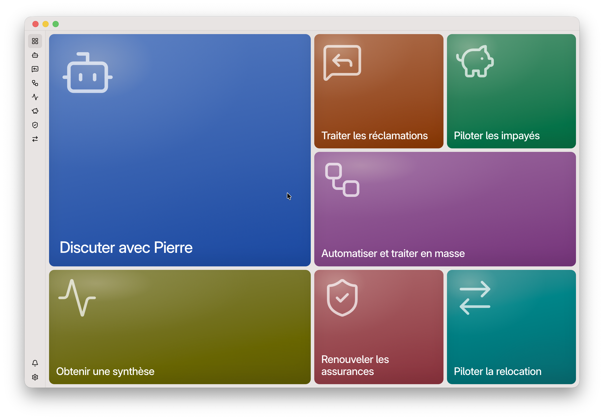

# PIERRE

- [En 30 secondes](#pierre)
- [Manifeste : « Constuire les _communs numériques_ du mouvement HLM »](#construire-les-communs-numériques-du-mouvement-hlm)
- [Fonctionnalités](#fonctionnalités-de-pierre) (WIP)

---

### Une application agentique, open source et gratuite au service du mouvement HLM

1. **Un outil pour tous les métiers** : réclamations, impayés, relocation, assurance-habitation… PIERRE réunit les équipes dans une interface cohérente et nativement collaborative, avec les mêmes repères d’un processus à l’autre. Une **application « User-First »** conçue pour simplifier le quotidien des collaborateurs et renforcer la performance opérationnelle.

2. **Une application également « AI-First »** : l’intelligence artificielle de votre choix comprend les dossiers, prépare les actions et les communications, automatise les tâches répétitives et attire l’attention de la bonne personne au bon moment au bon endroit. **Nativement agentique**, PIERRE ne se contente pas de répondre : il contribue et fluidifie la mise en oeuvre **de vos processus** aux côtés des équipes, et accompagne les locataires 24/7/365.

3. **Deux socles mutualisés pour accélérer tout le mouvement HLM** : [Core Data HLM](./02-data-primitives/index.md) donne aux IA un langage commun pour lire et comprendre les données-métier, sans multiplier les exports SI. [Core Intelligence HLM](../server/knowledge/) réunit les connaissances et les instructions qui leur permettent de raisonner et d’agir dans les processus. Évolutifs et enrichis en continu par les organismes, ces deux socles transforment chaque contribution locale en progrès collectif.

4. **Un « commun numérique HLM », libre, souverain et gratuit** : code open source, auditable et adaptable, auto-hébergement, maîtrise des données, libre choix du modèle d’IA, compatible RGPD et conforme aux exigences de l'IA act de l'UE. Aucun bailleur n’est captif d’un éditeur. **Chaque euro disponible est mobilisé pour financer l'activité patrimoniale et améliorer la qualité de service rendue au locataire.**

## Construire les « communs numériques » du mouvement HLM

### 300 M€/an. Depuis plus de 20 ans.

Le mouvement HLM consacre chaque année près de **300 millions d'euros** à ses applications-métiers : licences, maintenance, abonnements, études, intégration, recettes... Sur vingt ans, **6 milliards**[^*].

Le problème n'est pas tant le montant que ce qu'en obtient — en échange — le mouvement. Nul ne s'en satisfait, malgré l'engagement de tous ceux qui ont porté ces systèmes. Ni les locataires, ni les collaborateurs, ni les directions informatiques, ni les directions générales. Depuis plus de 20 ans.

À l'intersection d'un _coût de production logicielle qui tend vers zéro_ (du fait des progrès extraordinaires de l'intelligence artificielle) et du [forward-deployed engineering](https://en.wikipedia.org/wiki/Forward_Deployed_Engineer) (= intelligence du terrain × capacité à construire), **réinventer l'IT HLM n'est désormais plus contraint — comme hier — par le temps, la technologie ou le budget**, mais par la volonté des organismes HLM à opérer, ensemble, cette réinvention.

### L'époque (_epoch_) est aux builders et communs HLM

Depuis plus d'un siècle, le mouvement HLM bâtit un patrimoine commun, et des millions de logements ont été construits grâce à une conviction simple : ce qui est d'intérêt collectif mérite d'être construit collectivement. Cette même conviction peut désormais s'appliquer au numérique.

Les bailleurs sociaux — davantage confrères que concurrents — **partagent les mêmes métiers et les mêmes défis quotidiens**. Un plan d'apurement, une procédure d'astreinte, un état des lieux ou un parcours-locataire peuvent comporter des spécificités locales, mais reposent partout sur un même socle-métier. Pendant des décennies, chacun a pourtant financé (et souvent plusieurs fois) des logiciels répondant imparfaitement aux mêmes besoins. Les dettes technniques se sont accumulées, **et les évolutions sont devenues toujours plus longues, coûteuses et complexes**. À l'image d'un directeur général d’organisme HLM qui oublierait ce qu’est le métier réel d'un gardien, les éditeurs logiciels ont oublié le terrain.

Le mouvement HLM a inventé les « _communs immobiliers_ », il peut désormais inventer et mutualiser ses « _communs numériques open source_ » que chacun est libre d'utiliser, d'améliorer et d'adapter à ses besoins. **PIERRE constitue _la première pierre_ de cette ambition**.

### Pas de données. Pas d’innovation technologique.

Sans données structurées, pas d'innovation durable. Des [initiatives récentes](https://www.moduls.immo) le rappellent utilement. La tentation naturelle est alors d'y répondre par plusieurs années passées à concevoir un référentiel parfait, avant le moindre usage concret, retardant d'autant la valeur pour les équipes.

PIERRE prend donc une trajectoire orthogonale. Application agentique, elle n'a pas besoin d'un référentiel de données _parfait_ — juste **d'un socle minimal, solide et auto-compréhensible par une IA** pour être véritablement utile aux équipes et démultiplier les usages possibles.

Pas de modèle ontologique de 400 pages, pas de comité de normalisation sur trois ans. PIERRE propose un pragmatisme technologique et métier assumé avec des [Core Data HLM](./02-data-primitives/index.md). Co-construit à l’été 2026 avec **Grand Dijon Habitat**.

### Un logiciel « User-First × AI-First » au service du HLM

Les applicatifs historiques ont trop accumulé. Trop d'interfaces, trop de dette technique, trop de code spaghetti, trop de roadmap qui s'étirent à l'infini, épuisant les équipes et ne satisfaisant jamais réellement les utilisateurs (lassés d'avoir trop attendu). Cette accumulation a complexifié les parcours, introduit des lenteurs et progressivement — mais sûrement — fait diverger les outils des pratiques du quotidien et alimente les frustrations des utilisateurs.

Introduire l’IA dans les processus HLM ne consiste donc pas à ajouter un chatbot au-dessus de logiciels inchangés. **Il faut réinventer le logiciel lui-même**.

D'abord son architecture, pour permettre — _on demand_ — l'agréagation des informations nécessaires à l’analyse _agentique_ d’une situation d’impayé, d’une relocation ou d’une réclamation. Ensuite son interface, pour que l’IA puisse intervenir au bon moment, au bon endroit, automatiquement ou toujours sous le contrôle de l’utilisateur.

PIERRE est « **User-First × AI-First** » : l’intelligence artificielle n’est utile que lorsqu’elle simplifie concrètement le travail et renforce la capacité d’action des équipes. « **Human + IA : side-by-side** »

### Une complexité que l'on peut choisir de ne pas subir.

Le mouvement HLM n'a pas les contraintes de Wall Street : pas de trading haute fréquence, pas de millions de transactions par seconde, pas de besoins d'infrastructures que seuls les _hyperscalers_ peuvent fournir.

À l'échelle volumétrique du mouvement HLM — quelques millions de logements, quelques millions de réclamations, quelques dizaines de millions de quittances, un temps réel _au quart d'heure_ — une architecture simple n'est pas un manque d'ambition, c'est un arbitrage stratégique assumé : « [SQLite et un harnais suffisent pour le logement social français](./05-articles/2026-05-27-rag-sqlite.md) » (anglais).

### Modèle économique + gouvernance : une autre façon de construire et faire vivre les logiciels HLM

Le modèle historique des logiciels HLM repose sur des licences, des projets d'intégration coûteux, une forte dépendance à l'éditeur et une innovation très lente.

PIERRE prend le contre-pied : **le logiciel est librement accessible en open source (gratuit)**, il peut être téléchargé, installé, modifié, et amélioré librement par n'importe quel bailleur social. Pour que chaque euro serve d'abord à financer l'activité patrimoniale et améliorer la qualité de service rendue au locataire. Quant à la **gouvernance** : n'y aurait-il pas là quelque chose d'innovant à inventer au croisement de l'USH, des fédérations, des acteurs et de ses besoins ?

### Souveraineté, sécurité et protection des données. By design

La confidentialité est un principe fondateur de PIERRE. _Les données directement identifiantes_ — nom, prénom, adresse précise, e-mail ou numéro de téléphone — sont protégées. Chaque organisme conserve la maîtrise de son hébergement, de ses données et des services auxquels il choisit de faire appel.

PIERRE est compatible avec une approche _Bring Your Own Key_ (BYOK) : chaque bailleur choisit le modèle d’IA qu’il souhaite utiliser, ainsi que les conditions techniques et contractuelles de cet usage.

Les _conversations agentiques_ sont exécutées dans des environnements dédiés avec une _isolation matérielle_ afin d'éliminer la circulation de données entre les sessions. Cette architecture et les mesures associées ont été validées dans le cadre d’une **Analyse d’impact relative à la protection des données (AIPD) conduite avec Grand Dijon Habitat**.

PIERRE, **c'est la première brique de _souveraineté numérique_ du logement social** : un code auditable et maîtrisable, des données conservées sous le contrôle du bailleur et aucun fournisseur d’IA imposé.

### Un « commun » ne vaut que s’il est adopté par les équipes

Changer d’outil demande toujours un effort. En utiliser une vingtaine, sans cohérence d’interface ni continuité entre les processus, en demande davantage encore — chaque jour.

PIERRE propose une **expérience commune à l’ensemble des métiers** : mêmes repères, mêmes principes d’interaction et même espace de collaboration. Cette cohérence réduit la charge d’apprentissage et facilite le passage d’un processus à l’autre.

Mais aucune interface, même bien conçue, ne suffit à transformer une organisation. L’appropriation repose aussi sur l’implication des métiers, l’exemplarité du management, la formation et l’accompagnement du changement : PIERRE simplifie la prise en main ; **aux organismes d’en faire une capacité collective.**

**------------ NE PAS CONSIDERER : les éléments ci-dessous sont tous à reperendre ------------**

## Fonctionnalités de PIERRE

### L'IA qui donne une nouvelle capacité d'action au logement social

Originellement, PIERRE est un agent conversationnel — propulsé par IA et plurilingue — capable de répondre 24/7/365 à toutes les questions de « premier niveau » des candidats et locataires HLM.

Il s'appuie sur une **[base de connaissances commune au mouvement HLM](../server/knowledge/)**, enrichie en continu par les bailleurs sociaux, chaque amélioration bénéficiant immédiatement à l'ensemble du mouvement. Chaque organisme conserve naturellement ses spécificités et peut apprendre à PIERRE ses propres procédures et coordonnées en deux clics. Ainsi, _Toit de Gascogne_ lui a fourni les manuels d'utilisation de ses chaudières, permettant aux locataires d'obtenir instantanément des réponses claires aux questions pragmatiques du quotidien.

PIERRE s'intègre simplement à votre **site web**, votre **espace locataire** ou votre **agence virtuelle**, et s'adapte à votre identité graphique comme à vos contenus.

**Une réponse immédiate pour l'habitant. Une réduction des sollicitations simples pour les équipes. Une connaissance qui s'enrichit pour tout le mouvement.**

### PIERRE comprend votre métier, vos données et vos procédures

Au-delà de la relation-locataire, PIERRE devient un véritable assistant pour les collaborateurs HLM. Il répond aux questions en s'appuyant sur vos données, vos documents et vos procédures internes. Les questions peuvent être très simples « _Quelle est la procédure d'astreinte en cas de fuite d'eau dans les parties communes ?_ » ou beaucoup plus complexes « _Liste les résidences équipées de chaudières individuelles gaz raccordées à une VMC collective, avec leur adresse et le nombre de logements concernés_ ».

Les réponses sont adaptées au profil de l'utilisateur. Un **agent d'astreinte** recevra des consignes mettant en priorité sa sécurité et les premières actions à réaliser. Un **cadre d'astreinte** obtiendra, en complément, les éléments d'analyse, de coordination et de pilotage nécessaires à sa prise de décision. Chaque bailleur définit librement ses profils, leurs droits d'accès et les consignes qui orientent les réponses de l'agent.

**PIERRE ne donne pas seulement accès à l'information : il transforme l'information disponible en capacité d'action.**

### Les réclamations passent de la gestion administrative à la résolution intelligente

Les réclamations sont nombreuses, mais leur traitement reste souvent dispersé entre outils, e-mails et procédures. Avec PIERRE, les demandes sont automatiquement analysées, catégorisées et orientées vers le bon interlocuteur. L'agent prépare une réponse contextualisée à partir des connaissances du bailleur, tout en laissant le collaborateur garder la maîtrise de la validation.

Grâce à son architecture, PIERRE s'intègre à vos outils existants plutôt que de les remplacer. Les réponses générées peuvent ainsi être injectées directement dans vos applicatifs métiers, comme l'Agence Virtuelle (ACG Aravis) :

**Une couche d'intelligence au-dessus de vos outils existants : vos logiciels continuent d'exécuter les processus. PIERRE apporte la compréhension, l'analyse et l'assistance qui leur manquaient.**

### Chaque rendez-vous ou réunion commence avec la bonne information

Un rendez-vous avec un locataire dans cinq minutes ? Une réunion pour faire le point sur une situation délicate d'impayé ? Un échange avec une collectivité au sujet d'une résidence ou d'un programme de travaux ?

En quelques instants, PIERRE parcourt les données, les documents et les historiques pour **produire un briefing clair et directement exploitable** : contexte, événements marquants, points de vigilance, prochaines échéances, informations essentielles.

**Ne cherchez plus l'information avant une décision. Arrivez avec une compréhension complète de la situation.**

### L'impayé devient un processus piloté, pas une succession d'urgences

L'impayé est l'un des processus HLM les plus sensibles. Chaque jour compte : détecter rapidement une difficulté, comprendre la situation d'un locataire et déclencher la bonne action peut changer l'issue d'un dossier.

Avec PIERRE, **les nouvelles situations d'impayés sont automatiquement identifiées et priorisées**. Les équipes disposent immédiatement d'une vision claire des dossiers à traiter, de leur historique et des actions à engager.

En quelques secondes, PIERRE prépare les éléments nécessaires au suivi d'un dossier : analyse de la situation, synthèse du parcours locataire, proposition de plan d'apurement ou de protocole de cohésion sociale, points de vigilance et prochaines étapes.

Le suivi devient collaboratif : chaque dossier dispose de son espace de travail, les équipes peuvent commenter, se coordonner et suivre l'avancement des actions. PIERRE accompagne également la relation avec le locataire en préparant et automatisant les communications adaptées : courriers, e-mails ou RCS, avec le bon message au bon moment.

**Passer d'un recouvrement réactif à un accompagnement préventif : détecter plus tôt, agir plus vite, accompagner mieux.**

### La vacance devient un flux piloté en continu

> Avancement : 80 %

La relocation est un processus stratégique pour les bailleurs sociaux : chaque jour où un logement reste vacant représente une perte de ressources pour le patrimoine et retarde l'accès d'un ménage à un logement.

D'ici fin 2026, **BECKREL intégrera PIERRE** pour permettre aux équipes de superviser en temps réel les logements à relouer, suivre l'avancement de leur commercialisation, coordonner les prestataires et piloter les travaux nécessaires à leur remise en location.

**Un logement vacant n'est plus un dossier en attente : c'est une situation à piloter.**

### Renouvellement des attestations d'assurance-habitation : les tâches administratives répétitives deviennent invisibles

> Avancement : 80 %

Le renouvellement des attestations d'assurance-habitation est une obligation régulière qui mobilise inutilement les équipes lorsqu'il est traité manuellement.

Avec PIERRE, le suivi devient simple et continu : les locataires sont automatiquement sollicités, les relances sont adaptées, les documents reçus sont analysés, les anomalies sont détectées.

À réception du document, PIERRE vérifie sa conformité : période de validité, informations essentielles, cohérence avec le contrat attendu. En cas de doute, un collaborateur reprend naturellement la main.

**L'automatisation ne remplace pas le contrôle humain : elle lui redonne du temps.**

### PIERRE ne répond pas seulement. Il veille.

Un bon assistant ne répond pas seulement aux questions. Il sait aussi attirer l'attention au bon moment. Avec les **routines**, chaque équipe peut programmer des analyses automatiques et recevoir les informations qui comptent, au moment où elles deviennent utiles.

Quelques exemples :

- **Chaque jour à 17h50** : les points chauds avant la prise d'astreinte ;
- **Chaque lundi à 9h00** : les nouveaux locataires présentant des signaux d'insatisfaction ;
- **Chaque semaine** : les dossiers nécessitant une action ou un arbitrage.

**Un collaborateur ne devrait pas avoir à chercher les problèmes : son assistant devrait l'aider à les voir venir.**

### La mémoire collective de l'organisme ne doit plus disparaître

Les applicatifs HLM historiques savent gérer des dossiers. Ils savent moins bien raconter leur histoire. L'information est souvent dispersée entre l'ERP, les e-mails, les comptes rendus, les messages internes et les retours terrain.

Reconstituer l'avancement réel d'une situation peut demander de longues recherches, sans toujours retrouver la bonne information : dernier échange, décision prise, action attendue, interlocuteur concerné.

PIERRE intègre nativement un centre de notifications et de suivi collaboratif qui rassemble les événements importants d'un dossier : échanges internes, remontées terrain, communications avec les locataires ou partenaires, actions réalisées, prochaines étapes. _Chaque dossier retrouve ainsi une chronologie claire et partagée_.

**Quand l'information devient collective, l'organisation devient plus forte.**

### Le RCS devient une conversation interactive

Grâce à l'intégration des services RCS (le successeur du SMS) de [CM.com](https://cm.com/), **PIERRE permet aux bailleurs sociaux de communiquer avec leurs locataires via des messages enrichis directement dans leur application de messagerie** : boutons d'action, confirmations, documents, liens, réponses guidées : les démarches deviennent plus fluides pour les locataires et plus efficaces pour les équipes.

Relance d'attestation d'assurance, confirmation d'un rendez-vous, suivi d'une intervention, accompagnement d'une démarche administrative : chaque échange devient une opportunité de simplifier le parcours habitant. **Une communication plus moderne, sans imposer une nouvelle application au locataire.**

### Un logiciel que l'on ouvre huit heures par jour n'est pas un détail

Hors du bureau, les équipes HLM utilisent chaque jour des outils dont l'interface a été travaillée : Gmail, LinkedIn... Arrivés au travail, des logiciels datés et conçus pour l'administration plus que pour ceux qui les utilisent.

Or le logiciel métier, c'est le quotidien. Une interface soignée n'est pas un luxe : c'est une condition de la qualité de vie au travail — et, in fine, de l'adoption et de l'excellence opérationnelle.

PIERRE prend le contre-pied. L'interface s'inspire des meilleures pratiques UI/UX : claire, rapide, un peu de plaisir à l'ouvrir. Et parce que la collaboration est au cœur du produit — sans elle, rien ne fonctionne — chaque collaborateur se dote d'un avatar : vos collègues savent qui parle d'un regard, sans même lire le nom.

Huit heures dans un logiciel, c'est aussi le reste de la journée ailleurs. Les logiciels métier, une fois minimisés, deviennent muets. PIERRE reste : un compagnon sur le bureau, même fenêtre fermée. Un chiffre pour ce qui n'a pas été lu. Un visage qui change quand quelque chose vous attend. Un clic, et vous êtes de retour à l'endroit exact où votre attention est attendue.

**Un outil que l'on reconnaît, dans lequel on se reconnaît — et qui sait se rappeler à vous.**

## Et ensuite ?

Trois chemins, selon où vous en êtes. Dans tous les cas, **DG**, **Métiers** et **DSI** restent les interlocuteurs naturels pour voir, comprendre, décider, cadrer et déployer — et nous pouvons accompagner chaque étape.

### 1. Installer et mettre en route

PIERRE est conçu pour une mise en œuvre progressive, sans projet d'intégration de plusieurs mois.

En autonomie, l'ordre de grandeur est le suivant :

- **serveur et paramétrages (avec le Métier)** : typiquement de l'ordre d'un à deux jours-homme pour une DSI habituée au déploiement d'applications ;
- **postes collaborateurs** : quelques heures pour déployer l'application desktop ;
- **Core Data HLM** : quelques jours-homme, de façon progressive ;
- **prise en main** : PIERRE est pensé pour les équipes métier ; la formation est légère.

Si vous préférez aller plus vite, plus loin ou plus sereinement : **nous accompagnons à chaque étape** — démonstration, cadrage, hébergement, déploiement, paramétrage, création des data-primitives, formation des équipes. [Contactez-nous](mailto:charnould@pierre-ia.org).

### 2. Proposer un module utile à tout le mouvement

Vous avez un besoin métier récurrent, partagé par d'autres bailleurs ? PIERRE est bâti pour accueillir de nouveaux modules — sans plafond a priori.

Quelques pistes déjà évoquées avec des organismes :

- suivi des **ventes HLM** ;
- **rapprochement offre / demande** de logement ;
- automatisation d'une véritable **« journée locataire »** ;
- **mutations** et parcours de mobilité résidentielle ;
- suivi des **travaux** et interventions techniques ;
- **qualité de service** , satisfaction habitant et enquêtes-locataires ;
- réinvention de **espaces-locataires** ;
- ou tout autre processus HLM encore trop manuel et pas assez collaboratif.

Votre idée n'est pas dans la liste ? Tant mieux : [parlez-nous-en](mailto:charnould@pierre-ia.org).

### 3. Explorer, décider, avancer

- Spécification des « [_Core Data HLM_](./02-data-primitives/index.md) »
- Code source sur [GitHub](https://github.com/charnould/pierre)
- [Documentation](https://github.com/charnould/pierre) d'installation et de déploiement en autonomie
- Démonstration, cadrage DG/DSI, accompagnement hébergement / déploiement / paramétrage / formation : [contactez-nous](mailto:charnould@pierre-ia.org)

## Licence

Le code source de PIERRE est sous licence open source GNU _Affero General Public License Version 3_, avec une clause complémentaire encadrant certains usages commerciaux. La base de connaissances et les prompts sont sous licence _Creative Commons BY-NC-SA 4.0_.

PIERRE s'appuie sur de nombreuses bibliothèques open source ; elles sont toutes listées dans les `package.json` du dépôt. Merci à leurs créateurs et _mainteneurs_ qui [soutiennent l'infrastructure logicielle mondiale](https://xkcd.com/2347/).

Copyright © 2024-aujourd'hui · Charles-Henri Arnould/BECKREL SAS et les contributeurs.

---

[^*]: [Estimation du coût annuel des applications-métiers du mouvement HLM](./05-articles/2026-08-19-300M€Y-for-IT.md)
