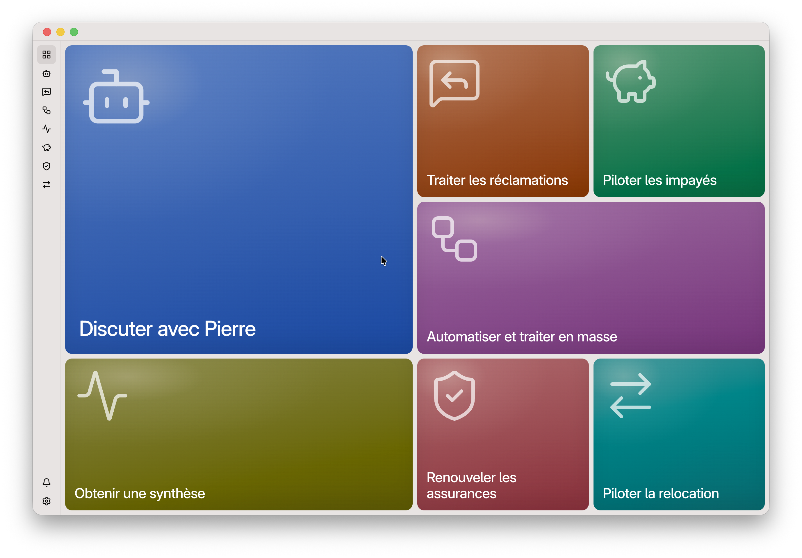

# PIERRE

## Une application agentique, open source et gratuite au service du mouvement HLM

1. **Un outil pour tous les métiers** : réclamations, impayés, relocation, assurance-habitation… PIERRE réunit les équipes dans une interface cohérente et nativement collaborative, avec les mêmes repères d’un processus à l’autre. Une **application « User-First »** conçue pour simplifier le quotidien des collaborateurs et renforcer la performance opérationnelle.

2. **Une application également « AI-First »** : l’intelligence artificielle de votre choix comprend les dossiers, prépare les actions et les communications, automatise les tâches répétitives et attire l’attention de la bonne personne au bon moment au bon endroit. **Nativement agentique**, PIERRE ne se contente pas de répondre : il contribue et fluidifie la mise en oeuvre **de vos processus** aux côtés des équipes, et accompagne les locataires 24/7/365.

3. **Un triple socle mutualisé pour accélérer tout le mouvement HLM** : [Core Data HLM](./02-core-data-hlm/index.md) donne aux IA un langage commun pour lire et comprendre les données-métier, sans multiplier les exports SI. [Core Models HLM](./03-core-models-hlm/index.md), une famille de modèles de langage open source, ultra-compacts et hyper-spécialisés, conçus pour accélérer et améliorer certaines tâches concrètes et chronophages du mouvement HLM. [Core Intelligence HLM](./04-core-intelligence-hlm/index.md) réunit les connaissances et les instructions qui leur permettent de raisonner et d’agir dans les processus. Évolutifs et enrichis en continu par les organismes, ces deux socles transforment chaque contribution locale en progrès collectif.

4. **Un « multiple commun numérique HLM », libre, souverain et gratuit** : code open source, auditable et adaptable, auto-hébergement, maîtrise des données, libre choix du modèle d’IA, compatible RGPD et conforme aux exigences de l'IA act de l'UE. Aucun bailleur n’est captif d’un éditeur. **Chaque euro disponible est mobilisé pour financer l'activité patrimoniale et améliorer la qualité de service rendue au locataire.**

## Construire les « communs numériques » du mouvement HLM

### 300 M€/an. Depuis plus de 20 ans.

Le mouvement HLM consacre chaque année près de **300 millions d'euros** à ses applications-métiers : licences, maintenance, abonnements, études, intégration, recettes... Sur vingt ans, [6 milliards](./07-articles/2026-08-19-300M€Y-for-IT.md)

Le problème n'est pas tant le montant que ce qu'en obtient — en échange — le mouvement. Nul ne s'en satisfait, malgré l'engagement de tous ceux qui ont porté ces systèmes. Ni les locataires, ni les collaborateurs, ni les directions informatiques, ni les directions générales. Depuis plus de 20 ans.

À l'intersection d'un _coût de production logicielle qui tend vers zéro_ (du fait des progrès extraordinaires de l'intelligence artificielle) et du [forward-deployed engineering](https://en.wikipedia.org/wiki/Forward_Deployed_Engineer) (= intelligence du terrain × capacité à construire), **réinventer l'IT HLM n'est désormais plus contraint — comme hier — par le temps, la technologie ou le budget**, mais par la volonté des organismes HLM à opérer, ensemble, cette réinvention.

### L'époque (_epoch_) est aux builders et communs HLM

Depuis plus d'un siècle, le mouvement HLM bâtit un patrimoine commun, et des millions de logements ont été construits grâce à une conviction simple : ce qui est d'intérêt collectif mérite d'être construit collectivement. Cette même conviction peut désormais s'appliquer au numérique.

Les bailleurs sociaux — davantage confrères que concurrents — **partagent les mêmes métiers et les mêmes défis quotidiens**. Un plan d'apurement, une procédure d'astreinte, un état des lieux ou un parcours-locataire peuvent comporter des spécificités locales, mais reposent partout sur un même socle-métier. Pendant des décennies, chacun a pourtant financé (et souvent plusieurs fois) des logiciels répondant imparfaitement aux mêmes besoins. Les dettes technniques se sont accumulées, **et les évolutions sont devenues toujours plus longues, coûteuses et complexes**. À l'image d'un directeur général d’organisme HLM qui oublierait ce qu’est le métier réel d'un gardien, les éditeurs logiciels ont oublié le terrain.

Le mouvement HLM a inventé les « _communs immobiliers_ », il peut désormais inventer et mutualiser ses « _communs numériques open source_ » que chacun est libre d'utiliser, d'améliorer et d'adapter à ses besoins. **PIERRE constitue _la première pierre_ de cette ambition**.

### Pas de données. Pas d’innovation technologique.

Sans données structurées, pas d'innovation durable. Des [initiatives récentes](https://www.moduls.immo) le rappellent utilement. La tentation naturelle est alors d'y répondre par plusieurs années passées à concevoir un référentiel parfait, avant le moindre usage concret, retardant d'autant la valeur pour les équipes.

PIERRE prend donc une trajectoire orthogonale. Application agentique, elle n'a pas besoin d'un référentiel de données _parfait_ — juste **d'un socle minimal, solide et auto-compréhensible par une IA** pour être véritablement utile aux équipes et démultiplier les usages possibles.

Pas de modèle ontologique de 400 pages, pas de comité de normalisation sur trois ans. PIERRE propose un pragmatisme technologique et métier assumé avec des [Core Data HLM](./02-core-data-hlm/index.md). Co-construit à l’été 2026 avec **Grand Dijon Habitat**.

### Un logiciel « User-First × AI-First » au service du HLM

Les applicatifs historiques ont trop accumulé. Trop d'interfaces, trop de dette technique, trop de code spaghetti, trop de roadmap qui s'étirent à l'infini, épuisant les équipes et ne satisfaisant jamais réellement les utilisateurs (lassés d'avoir trop attendu). Cette accumulation a complexifié les parcours, introduit des lenteurs et progressivement — mais sûrement — fait diverger les outils des pratiques du quotidien et alimente les frustrations des utilisateurs.

Introduire l’IA dans les processus HLM ne consiste donc pas à ajouter un chatbot au-dessus de logiciels inchangés. **Il faut réinventer le logiciel lui-même**.

D'abord son architecture, pour permettre — _on demand_ — l'agréagation des informations nécessaires à l’analyse _agentique_ d’une situation d’impayé, d’une relocation ou d’une réclamation. Ensuite son interface, pour que l’IA puisse intervenir au bon moment, au bon endroit, automatiquement ou toujours sous le contrôle de l’utilisateur.

PIERRE est « **User-First × AI-First** » : l’intelligence artificielle n’est utile que lorsqu’elle simplifie concrètement le travail et renforce la capacité d’action des équipes. « **Human + IA : side-by-side** »

### Une complexité que l'on peut choisir de ne pas subir.

Le mouvement HLM n'a pas les contraintes de Wall Street : pas de trading haute fréquence, pas de millions de transactions par seconde, pas de besoins d'infrastructures que seuls les _hyperscalers_ peuvent fournir.

À l'échelle volumétrique du mouvement HLM — quelques millions de logements, quelques millions de réclamations, quelques dizaines de millions de quittances, un temps réel _au quart d'heure_ — une architecture simple n'est pas un manque d'ambition, c'est un arbitrage stratégique assumé : « [SQLite et un harnais suffisent pour le logement social français](./07-articles/2026-05-27-rag-sqlite.md) » (anglais).

### Modèle économique + gouvernance : une autre façon de construire et faire vivre les logiciels HLM

Le modèle historique des logiciels HLM repose sur des licences, des projets d'intégration coûteux, une forte dépendance à l'éditeur et une innovation très lente.

PIERRE prend le contre-pied : **le logiciel est librement accessible en open source (gratuit)**, il peut être téléchargé, installé, modifié, et amélioré librement par n'importe quel bailleur social. Pour que chaque euro serve d'abord à financer l'activité patrimoniale et améliorer la qualité de service rendue au locataire. Quant à la **gouvernance** : n'y aurait-il pas là quelque chose d'innovant à inventer au croisement de l'USH, des fédérations, des acteurs et de ses besoins ?

### Souveraineté, sécurité et protection des données. By design

La confidentialité est un principe fondateur de PIERRE. _Les données directement identifiantes_ — nom, prénom, adresse précise, e-mail ou numéro de téléphone — sont protégées. Chaque organisme conserve la maîtrise de son hébergement, de ses données et des services auxquels il choisit de faire appel.

PIERRE est compatible avec une approche _Bring Your Own Key_ (BYOK) : chaque bailleur choisit le modèle d’IA qu’il souhaite utiliser, ainsi que les conditions techniques et contractuelles de cet usage.

Les _conversations agentiques_ sont exécutées dans des environnements dédiés avec une _isolation matérielle_ afin d'éliminer la circulation de données entre les sessions. Cette architecture et les mesures associées ont été validées dans le cadre d’une **Analyse d’impact relative à la protection des données (AIPD) conduite avec Grand Dijon Habitat**.

PIERRE, **c'est la première brique de _souveraineté numérique_ du logement social** : un code auditable et maîtrisable, des données conservées sous le contrôle du bailleur et aucun fournisseur d’IA imposé.

### Un « commun » ne vaut que s’il est adopté par les équipes

Changer d’outil demande toujours un effort. En utiliser une vingtaine, sans cohérence d’interface ni continuité entre les processus, en demande davantage encore — chaque jour.

PIERRE propose une **expérience commune à l’ensemble des métiers** : mêmes repères, mêmes principes d’interaction et même espace de collaboration. Cette cohérence réduit la charge d’apprentissage et facilite le passage d’un processus à l’autre.

Mais aucune interface, même bien conçue, ne suffit à transformer une organisation. L’appropriation repose aussi sur l’implication des métiers, l’exemplarité du management, la formation et l’accompagnement du changement : PIERRE simplifie la prise en main ; **aux organismes d’en faire une capacité collective.**

## Fonctionnalités + installation

_PIERRE prépare quelque chose._  
_Bientôt avec Grand Dijon Habitat._  
🚀

## Licence

Les différents composants de PIERRE — code source, modèles, données, taxonomies, prompts et ressources associées — sont distribués sous des licences adaptées à leur nature et à leurs usages.

La philosophie de PIERRE repose sur des licences ouvertes, notamment l’`AGPLv3` et les licences `Creative Commons`. La licence applicable est précisée individuellement pour chaque composant.

Les usages commerciaux par des tiers qui ne sont pas des bailleurs sociaux peuvent être soumis à une licence commerciale spécifique.

PIERRE s'appuie sur de nombreuses bibliothèques open source ; elles sont toutes listées dans les `package.json` du dépôt. Merci à leurs créateurs et _mainteneurs_ qui [soutiennent l'infrastructure logicielle mondiale](https://xkcd.com/2347/).

Copyright © 2024-aujourd'hui · Charles-Henri Arnould/BECKREL SAS et les contributeurs.
